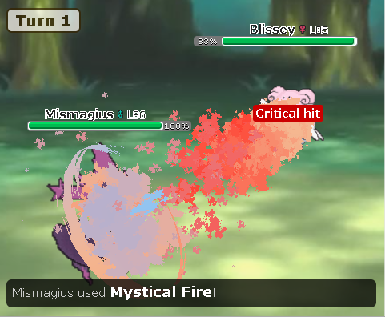
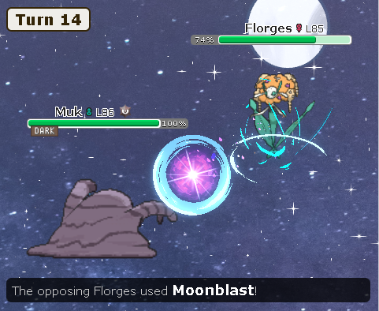

# Showmotion: Animations for Pokémon Showdown

  
  

## Introduction

A browser extension that adds custom visual effects to **single battles** on [Pokémon Showdown](https://play.pokemonshowdown.com/).
## Available effects

- Gunk Shot
- Hydro Pump
- Moonblast
- Mystical Fire
- Psychic
- Shadow Ball
- Swords Dance
- Will-O-Wisp
- More upcoming...

## Install on Chromium (Chrome, Edge, Brave...)

1. Download the latest `.zip` from the [Releases](../../releases) page
2. Extract the `.zip` to a folder on your computer
3. Open `chrome://extensions`
4. Enable `Developer mode` (top right corner in Chrome)
5. Click `Load unpacked`
6. Select the `Showmotion/` folder from the extracted files
7. Open `https://play.pokemonshowdown.com/`

## Performance Tips

For the best visual quality and smooth performance (especially with multiple effects), make sure your browser is using your dedicated GPU:

Go to Windows Settings → System → Display → Graphics
Add your browser (e.g. Chrome, Edge, Brave)
Set it to High Performance
Restart the browser

Also ensure:

Hardware acceleration is enabled in your browser settings
Your GPU drivers are up to date

## Support
Showmotion is completely free. If you'd like to support the creation of new animations and the future of this project, it's greatly appreciated:

